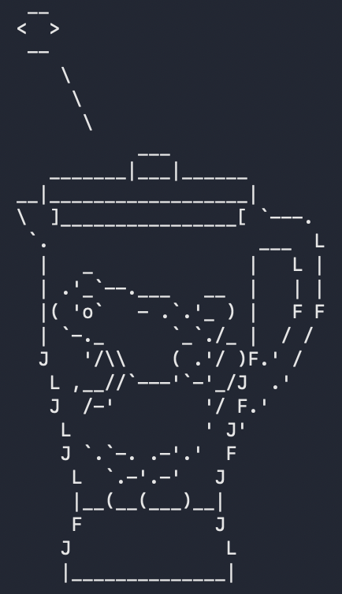
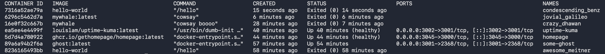
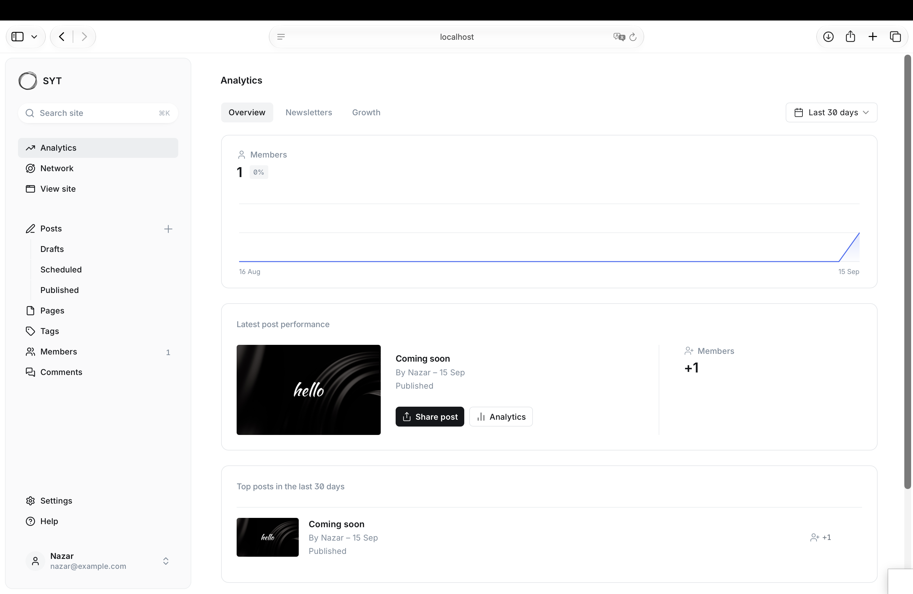
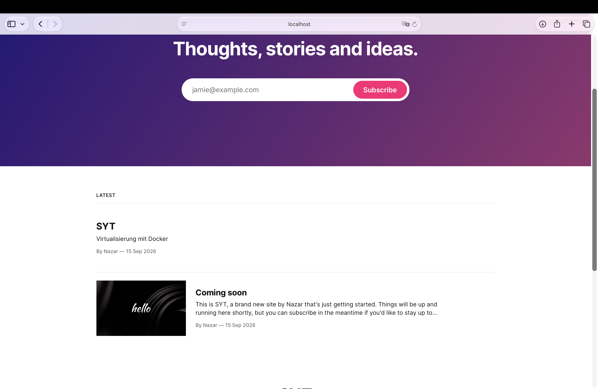
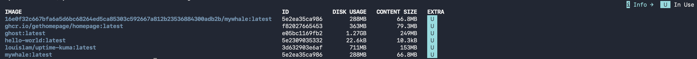
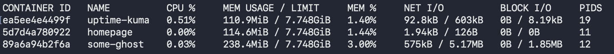
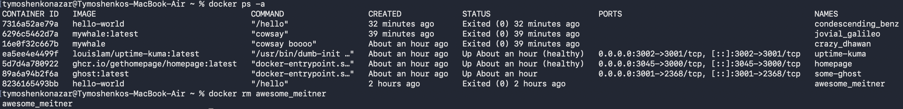
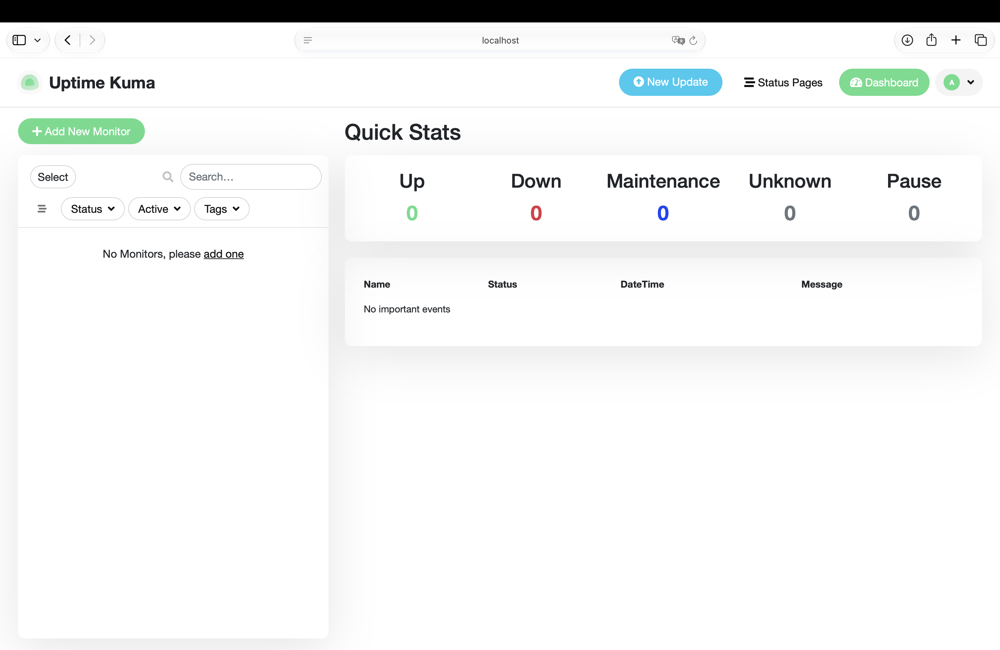
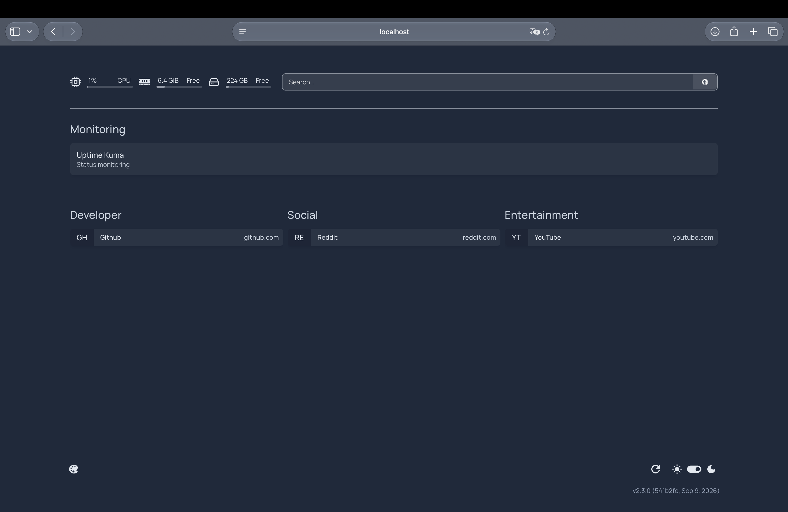

# Virtualisierung mit Docker

Ziel dieser Übung war die Anpassung containerbasierter Virtualisierungsumgebungen sowie die Veröffentlichung und Bereitstellung eigener Docker-Images. Im Folgenden sind die durchgeführten Schritte, die verwendeten Befehle und deren Ergebnisse dokumentiert.

---

## Teil 0 – Installation

Als Host-System wurde ein MacBook Air M2 (Apple Silicon) verwendet. Da die Aufgabenstellung ausdrücklich erlaubt, Docker direkt am nativen Betriebssystem zu betreiben (und nicht in einer VM), wurde **Docker Desktop for Mac (Apple Silicon)** installiert (https://www.docker.com/products/docker-desktop/).

Installationstest:

```bash
docker run docker/whalesay cowsay boo
```



Beim zuletzt ausgeführten Test endete der Befehl mit Exit-Code `125`. Dieser Code weist auf einen Fehler beim Starten des Containers hin; die genaue Terminal-Fehlermeldung muss zusammen mit der behobenen Ursache dokumentiert werden, bevor die Installation als erfolgreich abgeschlossen bezeichnet wird.

**Hinweis zu Benutzerrechten und Dienststart:** Unter Linux muss der Benutzer der Gruppe `docker` hinzugefügt werden (`sudo usermod -aG docker $USER`), damit der Docker-Client ohne `sudo` mit dem Docker-Daemon kommunizieren kann; anschließend ist ein Logout/Login nötig. Der Daemon läuft dort als systemd-Dienst und kann mit `systemctl status docker.service` (bzw. `start`/`stop`) verwaltet werden. Unter macOS entfällt dieser Schritt: Docker Desktop übernimmt Rechteverwaltung und Daemon-Start selbst; der Status lässt sich über das Docker-Desktop-Icon in der Menüleiste bzw. mit `docker info` prüfen.

Unter **Windows** läuft der Docker-Daemon als Windows-Dienst (`com.docker.service`). Er lässt sich über `services.msc`, in PowerShell mit `Get-Service docker` / `Start-Service docker` / `Stop-Service docker`, oder direkt über die Docker-Desktop-Oberfläche starten bzw. stoppen.

---

## Teil 1 – Der erste Container

```bash
docker run hello-world
```

Ablauf laut Ausgabe des Befehls:

1. Der Docker-Client kontaktiert den Docker-Daemon.
2. Der Daemon findet das Image `hello-world` lokal nicht und lädt es von Docker Hub herunter.
3. Aus dem Image wird ein neuer Container erstellt, der das ausführbare Programm startet, welches die Textausgabe erzeugt.
4. Der Daemon streamt diese Ausgabe an den Client, der sie im Terminal anzeigt.

```bash
docker ps -a
```



CONTAINER ID IMAGE COMMAND CREATED STATUS PORTS NAMES
16e0f32c667b mywhale "cowsay boooo" 14 minutes ago Exited (0) 14 minutes ago crazy_dhawan
ea5ee4e4499f louislam/uptime-kuma:latest "/usr/bin/dumb-init …" 26 minutes ago Up 26 minutes (healthy) 0.0.0.0:3002->3001/tcp, [::]:3002->3001/tcp uptime-kuma
5d7d4a780922 ghcr.io/gethomepage/homepage:latest "docker-entrypoint.s…" 30 minutes ago Up 30 minutes (healthy) 0.0.0.0:3045->3000/tcp, [::]:3045->3000/tcp homepage
89a6a94b2f6a ghost:latest "docker-entrypoint.s…" 42 minutes ago Up 40 minutes 0.0.0.0:3001->2368/tcp, [::]:3001->2368/tcp some-ghost
8236165493bb hello-world "/hello" 44 minutes ago Exited (0) 44 minutes ago awesome_meitner

**Analyse:** `-a` zeigt alle Container, nicht nur laufende. Der `hello-world`-Container erscheint mit Status **`Exited (0)`**, da er kein dauerhaft laufender Prozess ist, sondern nach dem Ausgeben des Textes sofort beendet wird. Die Spalten sind: `CONTAINER ID`, `IMAGE`, `COMMAND` (im Container ausgeführter Befehl), `CREATED`, `STATUS`, `PORTS`, `NAMES`.

---

## Teil 2 – Fertige Images und deren Einstiegspunkt (Ghost)

```bash
docker run -d --name some-ghost -e NODE_ENV=development -e url=http://localhost:3001 -p 3001:2368 ghost:latest
```

Bedeutung der Parameter:

- `-d` (detached): Container läuft im Hintergrund.
- `--name some-ghost`: fester Containername.
- `-e NODE_ENV=development`, `-e url=...`: Umgebungsvariablen; `url` teilt Ghost mit, unter welcher Adresse es von außen erreichbar ist.
- `-p 3001:2368`: Portmapping `<Hostport>:<Containerport>` — Ghost lauscht intern auf 2368, extern erreichbar über 3001.
- `ghost:latest`: verwendetes Image inkl. Tag.


Das Admin-Backend (der "Einstiegspunkt" für die Verwaltung) befindet sich unter **http://localhost:3001/ghost**. Dort wurde ein Administrator-Account angelegt:





---

## Teil 3 – Images verwalten

```bash
docker images
# äquivalent: docker image ls
```



Angezeigte Spalten: `REPOSITORY`, `TAG`, `IMAGE ID`, `CREATED`, `SIZE`.

```bash
docker pull <image>          # Image herunterladen, ohne Container zu starten
docker image prune -a        # entfernt alle nicht mehr referenzierten Images
docker rmi hello-world:latest
```

**Verhalten bei noch benötigtem Image:** Existiert noch (auch nur ein gestoppter) Container, der auf das Image verweist, verweigert `docker rmi` das Löschen mit einer Fehlermeldung wie `image is being used by stopped container ...`. Der Container muss zuerst mit `docker rm` entfernt werden (oder `docker rmi -f` erzwingt die Löschung).

Weitere Unterbefehle von `docker image`: `inspect` (Detailinformationen als JSON), `history` (Layer-Historie eines Images), `tag` (neuen Tag vergeben), `save`/`load` (Export/Import als `.tar`-Datei).

---

## Teil 4 – Container verwalten

```bash
docker ps        # nur laufende Container
docker ps -a      # + gestoppte, Status "Exited (Code)"
```

Start/Stopp eines bereits existierenden Containers (ohne Neuerstellung):

```bash
docker stop some-ghost
docker start some-ghost
```

```bash
docker top some-ghost      # im Container laufende Prozesse
docker stats                 # Live-Monitoring von CPU/RAM/Netzwerk aller Container
docker logs -f some-ghost   # -f = follow, Live-Mitschnitt der Logs
```



Entfernen der übrig gebliebenen `hello-world`-Container:

```bash
docker ps -a
docker rm <container_id_oder_name>
```



---

## Teil 5 – Container orchestrieren (Docker Compose)

`docker-compose.yml` (in eigenem Ordner, außerhalb von Cloud-Sync-Ordnern wie OneDrive/Dropbox, da Volumes reale Pfade verwenden):

```yaml
version: "3.3"

services:
  uptime-kuma:
    image: louislam/uptime-kuma:latest
    container_name: uptime-kuma
    volumes:
      - ./uptime-kuma-data:/app/data
      - /var/run/docker.sock:/var/run/docker.sock
    ports:
      - 3002:3001
    restart: always

  homepage:
    image: ghcr.io/gethomepage/homepage:latest
    container_name: homepage
    ports:
      - 3045:3000
    volumes:
      - ./homepage-config:/app/config
      - /var/run/docker.sock:/var/run/docker.sock
    environment:
      HOMEPAGE_ALLOWED_HOSTS: localhost:3045
```

`volumes` mit Host-Pfad (z. B. `./uptime-kuma-data:/app/data`) sind Bind-Mounts: Daten liegen persistent auf dem Host und überleben ein Neuerstellen des Containers. Das Mounten von `/var/run/docker.sock` gibt beiden Diensten Zugriff auf den Docker-Socket des Hosts, damit sie selbst laufende Container erkennen und anzeigen können (Docker-Integration von Homepage, Monitor-Typ "Docker Container" in Uptime Kuma).

```bash
docker-compose up -d
```

**Erwartete Ursache:** Port **3001** wurde bereits in Teil 2 für Ghost (`-p 3001:2368`) belegt. Läuft der Ghost-Container noch, kann Compose den Port `3001:3001` für uptime-kuma nicht binden (`bind: address already in use`).

**Lösung:** Ghost verwendete bereits den Host-Port 3001. Deshalb wurde das Portmapping von Uptime Kuma auf `3002:3001` geändert. Uptime Kuma ist dadurch im Browser unter http://localhost:3002 erreichbar; der Container verwendet intern weiterhin Port 3001.

Die zusätzliche Änderung in der YAML-Datei lautet:

```yaml
ports:
  - 3002:3001
```

Verwaltung aller Dienste der Datei mit einem Befehl:

```bash
docker-compose ps
docker-compose stop
docker-compose down        # stoppen + entfernen (inkl. Netzwerk)
docker-compose pull && docker-compose up -d   # aktualisieren
```

**Uptime Kuma** (http://localhost:3002):



Monitore:

- HTTP(s)-Monitor für `https://elearning.tgm.ac.at/`
- Ping-Monitor mit Hostname `homepage` (funktioniert dank des gemeinsamen Compose-Netzwerks, in dem Container sich über ihren Servicenamen erreichen)

Die vorliegende Aufnahme zeigt den Uptime-Kuma-Dashboard-Zustand zum Zeitpunkt der Dokumentation. Sie zeigt derzeit noch keine Monitore; die Zähler stehen alle auf 0. Für die vollständige Aufgabenlösung müssen noch ein HTTP(s)-Monitor für `https://elearning.tgm.ac.at/` und ein Ping-Monitor mit dem Hostnamen `homepage` angelegt und anschließend als Screenshot dokumentiert werden.

Es wurde keine Benachrichtigung eingerichtet.

**Homepage** (http://localhost:3045): Konfigurationsdateien liegen im Ordner `./homepage-config` (u. a. `services.yaml`). Ergänzung:

```yaml
- Monitoring:
    - Uptime Kuma:
        href: http://localhost:3002/
        description: Status monitoring
```



**Weitere Überwachungsmöglichkeiten:** Uptime Kuma kann neben HTTP(s)- und Ping-Monitoren auch TCP-, DNS-, JSON-Query- und Docker-Container-Monitore verwenden. Homepage kann über den Docker-Socket Container und deren Ressourcen anzeigen. Zusätzlich lassen sich in Homepage unter anderem Wetter-, Lesezeichen- und RSS-Widgets konfigurieren.

---

## Teil 6 – Eigene Images erstellen und deployen

`Dockerfile` (ohne Dateiendung):

```dockerfile
FROM ubuntu:14.04

RUN apt-get update && apt-get install -y cowsay --no-install-recommends && rm -rf /var/lib/apt/lists/* \
    && mv /usr/share/cowsay/cows/default.cow /usr/share/cowsay/cows/orig-default.cow

ENV PATH $PATH:/usr/games

COPY docker.cow /usr/share/cowsay/cows/
RUN ln -sv /usr/share/cowsay/cows/docker.cow /usr/share/cowsay/cows/default.cow

CMD ["cowsay"]
```

Erklärung der Direktiven: `FROM` legt das Basisimage fest; `RUN` führt einen Befehl **zur Build-Zeit** aus und erzeugt daraus einen neuen Layer; `ENV` setzt eine Umgebungsvariable, die sowohl beim Build als auch in allen aus dem Image gestarteten Containern verfügbar ist; `COPY` kopiert eine Datei vom Build-Kontext (Host) in das Image; `CMD` definiert den Standardbefehl beim Start eines Containers (überschreibbar durch explizite Angabe beim `docker run`).

`docker.cow` wurde von https://raw.githubusercontent.com/docker/whalesay/master/docker.cow heruntergeladen und individuell angepasst:

```bash
docker build -t mywhale:latest .
docker run mywhale cowsay boooo
```


**Veröffentlichung auf Docker Hub:**

````bash
docker login
Für die Veröffentlichung muss das lokale Image zuerst mit dem eigenen Docker-Hub-Benutzernamen getaggt und anschließend gepusht werden:

```bash
docker tag mywhale:latest DOCKERHUB_USERNAME/mywhale:latest
docker push DOCKERHUB_USERNAME/mywhale:latest
````

Ein konkreter Docker-Hub-Benutzername, ein Repository-Link und eine Push-Ausgabe sind in den vorliegenden Dateien nicht enthalten. Diese Angaben müssen vor der PDF-Abgabe durch die tatsächlich verwendeten Werte ersetzt werden.

```

---

## Quellen

- Aufgabenstellung: https://tgm-hit.github.io/syt-exercises/betriebssysteme_/sem06_virtualisierung_docker/TASK%20lab/
- Docker-Dokumentation: https://docs.docker.com/
- Docker Compose-Dokumentation: https://docs.docker.com/compose/
- Ghost auf Docker Hub: https://hub.docker.com/_/ghost
- Uptime Kuma: https://github.com/louislam/uptime-kuma
- Homepage: https://gethomepage.dev
- Docker Hub Images und Repositories: https://docs.docker.com/docker-hub/

```
